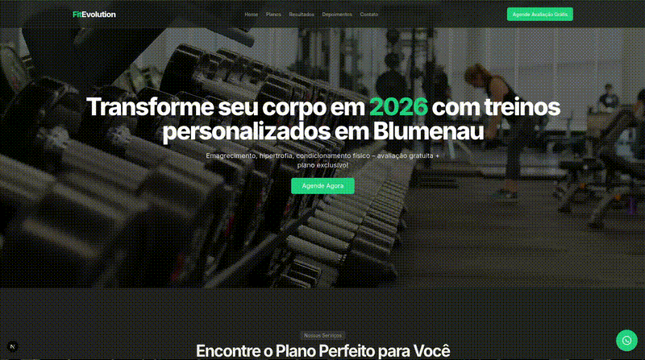

# Fit Evolution Blumenau - Landing Page

Landing page moderna, motivacional e focada em conversão para personal trainer / coach de emagrecimento e fitness em Blumenau/SC.  

**APENAS FRONT-END!!**

Terceiro projeto do meu portfólio front-end para demonstrar variedade em nichos locais (beleza, saúde bucal, fitness).

**Live Demo:**  
[FitEvolution](https://landing-page-coach-academia-blumena.vercel.app/) 

  

## Sobre o Projeto

Página fictícia para o "Fit Evolution Blumenau", com design energizante, cores de motivação (verde energia, laranja, preto/branco) e foco em captar alunos via WhatsApp (avaliação grátis) e formulário de contato.

### Seções Principais
- **Navbar fixo**: Logo, links (Home, Planos, Resultados, Depoimentos, Contato) + botão "Agende Avaliação Grátis"
- **Hero impactante**: Imagem de fundo motivacional (treino intenso), título "Transforme seu corpo em 2026" + subtítulo com benefícios + CTA grande WhatsApp
- **Planos/Serviços**: Cards responsivos (Treino Presencial, Online, Emagrecimento Rápido, Hipertrofia, Acompanhamento Nutricional)
- **Resultados Reais (Antes/Depois)**: Pares de imagens com legendas de transformações (ex: -15kg em 4 meses)
- **Depoimentos**: Cards com fotos, nomes e textos positivos (estrelas 5/5)
- **Formulário de contato**: Nome, WhatsApp, Objetivo (select), Mensagem – pronto para EmailJS
- **Footer**: Endereço em Blumenau, WhatsApp, Instagram, frase motivacional

### Tecnologias Usadas
- HTML5
- Tailwind CSS
- JavaScript básico
- Deploy: Vercel

### Features
- 100% responsivo (mobile-first, tudo centralizado em desktop e mobile)
- Tema motivacional: verde energia (#10B981), laranja (#F97316), preto/branco
- CTA direto: WhatsApp flutuante + botão grande
- Código limpo com comentários em português
- Fácil customização para clientes reais (personal trainers, coaches, academias)

- **APENAS FRONT-END!!**
